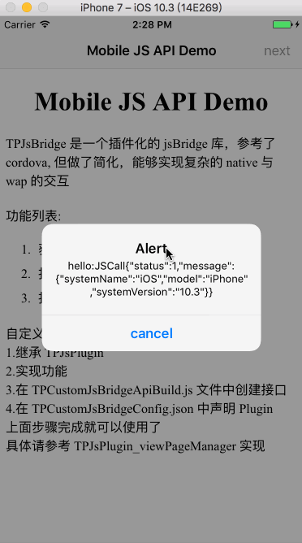

# TPJsBridge
An iOS/OSX bridge for sending messages between Obj-C and JavaScript in WKWebView.

TPJsBridge 是一个插件化的 jsBridge 库，参考了 cordova，但做了简化，能够实现复杂的 native 与 wap 的交互
    
## Usage
`pod 'TPJsBridge', '~> 0.0.15'`

```
Initialization code:
NSString *configFilePath = [[NSBundle mainBundle] pathForResource:@"TPCustomJsBridgeConfig" ofType:@"json"];

NSString *apiBuildFilePath = [[NSBundle mainBundle] pathForResource:@"TPCustomJsBridgeApiBuild" ofType:@"js"];
    
self.service = [[TPJsService alloc] initWithConfigFilePath:configFilePath apiBuildFilePath:apiBuildFilePath];
    
[self.service connect:webView];
```
    
    
    
    自定义 Plugin 流程：
    1.继承 TPJsPlugin 
    2.实现功能 
    3.在 TPCustomJsBridgeApiBuild.js 文件中创建接口 
    4.在 TPCustomJsBridgeConfig.json 中声明 Plugin 
    上面步骤完成就可以使用了 
    具体请参考 TPJsPlugin_viewPageManager 实现



